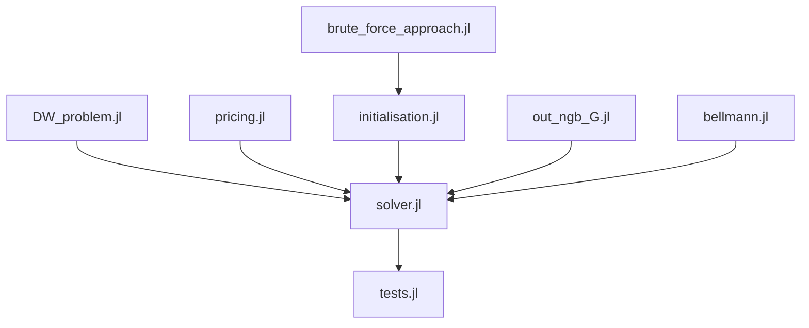

# \[ONGOING\] Column generation for Kidney Exchange Program (KEP) optimization (Integer Linear Programming)

## Description

Project to implement in **Julia** the column generation method for the Integer Linear (ILP) formulation of the kidney exchange programming (KEP) problem. This project is supervised by pr. Jérémy OMER. The KEP problem data comes from the [PrefLib dataset](https://preflib.github.io/PrefLib-Jekyll/dataset/00036).

## Code architecture

| File | Description | Functions |
|----|-------------|----------------------|
| `DW_problem.jl` | handles the main "master" problem : initialization, udpate and solving | *initialize_DW_dual*, *add_cycles_DW_dual!*, *solve_DW_dual* | 
| `pricing.jl` | handles the ILP formulation of the sub-problems  :  initialization, udpate and solving | *initialize_SP_o*, *objective_SP_o!*, *solve_SP_o_ILP*, *princing_ILP* |
| `brute_force_approach.jl` | allow to solve the complete DW formulation by computing all cycles of length <= K | *enumerate_cycles*, *brut_force* |
| `initialization.jl`| 
