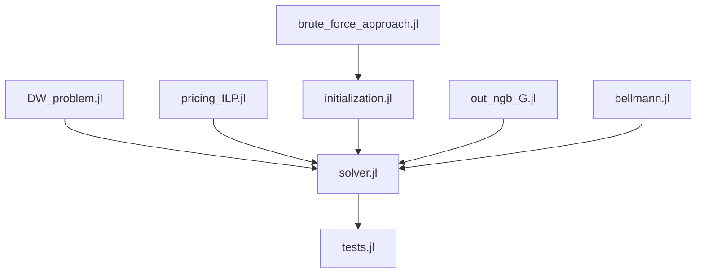

# \[ONGOING\] Column generation for Kidney Exchange Program (KEP) optimization (Integer Linear Programming)

## Description

Project to implement in **Julia** the column generation method for the Integer Linear (ILP) formulation of the kidney exchange programming (KEP) problem. This project is supervised by pr. Jérémy OMER. The KEP problem data comes from the [PrefLib dataset](https://preflib.github.io/PrefLib-Jekyll/dataset/00036).

## Code architecture

| File | Description | Functions |
|----|-------------|----------------------|
| `bellmann.jl` | handles the Bellman formulation of the sub-problems  :    | *Bellman_search*, *pricing_Bellman* |
| `brute_force_approach.jl` | allow to solve the complete DW formulation by computing all cycles of length <= K | *enumerate_cycles*, *brut_force* |
| `DW_problem.jl` | handles the main "master" problem : initialization, udpate and solving | *initialize_DW_dual*, *add_cycles_DW_dual!*, *solve_DW_dual* | 
| `initialization.jl`| methods to compute the first cycles (initialized) | *first_cycles_K*, *first_G_op* | 
| `out_ngb_G.jl` | build the outneigbors G_o_prime graphs for the ILP formulation of the subproblems | *build_Gs_prime* | 
| `pricing_ILP.jl` | handles the ILP formulation of the sub-problems  :  initialization, udpate and solving | *initialize_SP_o*, *objective_SP_o!*, *solve_SP_o_ILP*, *princing_ILP* |
| `solver.jl` | column generation for the relaxed DW problem and ILP solver for the integer (first problem) | *column_generation_ILP*, *integer_solution* | 
| `tests.jl` | builds and lunch test on KEP instances | *KEP_test*, *solve_KEP* | 

